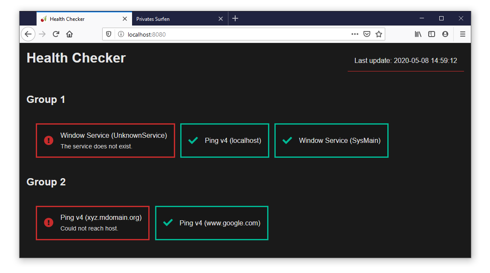

# Python Health Checker

The python health checker is a small app which regularly executes user-defined checks and optionally sends e-mail notifications when these checks fail. It makes it very easy to configure and extend it with new health checks.

### 1 Web-UI


### 2 Prerequisites
- CherryPy
- psutil (for the windows-service checker)

### 3 What happens on failed checks?

If the built-in smtp notifier is configured (see [testconfig.conf](testconfig.conf)), a mail is sent to the configured recipient. To avoid spamming mails when the state changes frequently, the notification frequency is throttled to allow only one notification per day and per check.

### 4 How it works

#### 4.1 Introduction
In its default configuration, the app runs the checks every minute. A full check cycle consists of the following steps:
- load the checker extensions (e.g. ping) and notifier extensions (e.g. smtp / e-mail)
- execute all checks and collect their results (success vs. error)
- pass the results to the configured notifiers
- write the results into an html file

The app uses ```cherrypy``` to serve the generated html file and other static resources to the browser. The html file contains a very small javascript snippet to reload the web-page automatically every few seconds.

#### 4.2 Run it yourself
To get started, clone this repo and start the app using python:

```ps
git clone https://github.com/Apollo3zehn/PythonHealthChecker
python ./Main.py
```

This will run the app with default settings, i.e:
- listen on address http://localhost:80
- one check per minute
- load the test config file ```testconfig.conf```

You can override the defaults by passing one or more of the following arguments to python:
```ps
python ./Main.py --host 0.0.0.0 --port 8080 `
                 --interval 300 --config myconfig.conf
```

#### 4.3 Create your own config
The app uses a simple config file, which should start with the shown ```# notifications``` section to setup the smtp / e-mail notification. This section is optional and only required when you would like to get notified by mail:

```ini
# notifications
[my-notifier]
type = smtp
security = starttls
server = xxx.net
port = 587
password = xxx
from = xxx@yyy.net
to = zzz@aaa.net
subject = Health-Check Report
```

No matter if you have a ```# notifications``` or not, the configuration file must contain a ```# checks``` section to configure all desired checks. In the sample configuration below, the first check is a ping to address ```www.test.org``` and the second check ensures that a certain windows service is available and started.

```ini
# checks
[Group 1]
type = ping-v4
notifiers = my-notifier
address = www.test.org

[Group 1]
type = windows-service
notifiers = my-notifier
name = SysMain
```

The line ```[Group 1]``` denotes the group name to help combining multiple checks into related units as you can see in the screenshot above.

Both checks refer to the previously defined notifier named `my-notifier`. Whenever the check fails it is notified to all configured notifiers. You can comma-separate multiple notifiers like `my-notifer-1, my-notifier-2, ...`

When your configuration file is complete, you can pass it to the app with the ```--config``` option: ```python ./Main --config <config file>```

> **NOTE:**  When you update the configuration file at runtime, it is applied automatically during the next health check.

### 5 Create your own checker extension
If you need other checks, you can implement it yourself easily. Here is an example how a checker could be implemented:

```python
from typing import Dict

from ..BaseTypes import Checker, CheckResult

class SampleChecker(Checker):
    Type: str = "sample-checker"
    MyOption1: str

    def __init__(self, settings: Dict[str, str]):
        super().__init__(settings)
        self.MyOption1 = settings["my-option1"]
        self.MyOption2 = settings["my-option2"]

    def GetName() -> str:
        return "SampleChecker"

    async def DoCheckAsync(self) -> CheckResult:
        if self.MyOption1 == "some value":
            return self.Success()
        else:
            return self.Error(f"The value '{self.MyOption1}' is invalid.")

```

Make sure your class inherits from ```Checker``` and calls the base class`s constructor (```super().__init__(settings)```). You can use the ```settings``` dictionary to get access to the options in the config file.

The methods ```GetName()``` and ```DoCheckAsync()``` are required and called by the base class when the check is executed.

On a successful check you can either call ```self.Success()``` or ```self.Success(<your success message>)```. When an error occured, call ```self.Error(<your error message>)``` instead.

When you are done, copy the new python file into the ```./src/Extensions``` folder, it you are not restarting the app, it will instead be (re)loaded automatically during the next check cycle.

With your new check in place, you should update your configuration file like this to define one or multiple checks:

```ini
# notifications
...

# checks
[My Group]
type = sample-checker
notifiers = my-notifier
my-option1 = some value
my-option2 = some value

[My Group]
type = sample-checker
notifiers = my-notifier
my-option1 = some value
my-option2 = some value

...
```

Please see the [testconfig.conf](testconfig.conf) file for a full sample.

### 6 Create your own notifier extension
If you need another notifier instead of smtp, the process is similar to that of the checker extension.

```python
import os
from typing import Dict, List

from ..BaseTypes import CheckResult, Notifier


class SampleNotifier(Notifier):
    Type: str = "sample-notifier"
    MyOption1: str
    MyOption2: str

    def __init__(self, settings: Dict[str, str]):
        super().__init__(settings)

        self.MyOption1 = settings["my-option1"]
        self.MyOption2 = settings["my-option2"]

    async def NotifyAsync(self, checkResult: Dict[str, List[CheckResult]]):

        # The following is a sample of how to construct a string message from
        # all checks, which are contained in the checkResult variable.

        # 1. Get a notifcation message for each check group
        contents = [self._getGroupContent(group, checkResults) for (group, checkResults) in result.items()]
        message = "\n".join(contents)

        # 4. notify everyone that wants to be notified
        # sending 'message' ...
        
    def _getGroupContent(self, group: str, checkResults: List[CheckResult]) -> str:

        # 2. Get a notifiations message for each check result within the group
        contents = [self._getContent(checkResult) for checkResult in checkResults]
        message = group + "\n" +  "\n".join(contents)

        return message

    def _getContent(self, checkResult: CheckResult) -> str:
        return f"{checkResult.Name}: {checkResult.Message}"
```

Make sure your class inherits from ```Notifier``` and calls the base class`s constructor (```super().__init__(settings)```). You can use the ```settings``` dictionary to get access to the options in the config file.

The method ```NotifyAsync()``` is required and called by the base class when the notifiers are executed. The other methods are only there to help constructing a readable message from the check result.

When you are done, copy the new python file into the ```./src/Extensions``` folder, it you are not restarting the app, it will instead be (re)loaded automatically during the next check cycle.

With your new notifier in place, you should update your configuration file like this to define one or multiple notifiers:

```ini
# notifications
[my-notifier]
type = sample-notifier
my-option1 = some value
my-option2 = some value

[my-notifier]
type = sample-notifier
my-option1 = some other value
my-option2 = some other value

...

# checks
...
```

Please see the [testconfig.conf](testconfig.conf) file for a full sample.